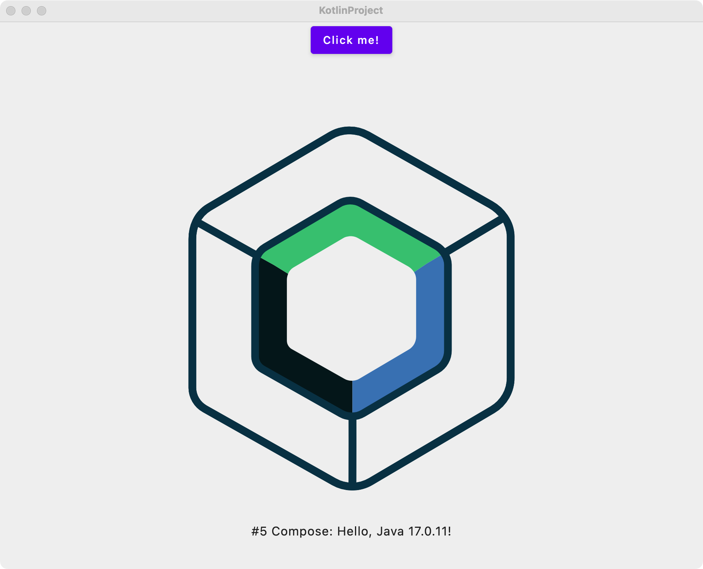

# ComposeHooks

<picture>
  
</picture>

[English](https://github.com/junerver/ComposeHooks/blob/master/README.md) | 简体中文

[](http://www.apache.org/licenses/LICENSE-2.0)
[](https://central.sonatype.com/artifact/xyz.junerver.compose/hooks)
[](https://github.com/junerver/ComposeHooks/releases/latest)
[](https://github.com/junerver/ComposeHooks/releases/latest)
[](http://isitmaintained.com/project/junerver/ComposeHooks "Average time to resolve an issue")
[](http://isitmaintained.com/project/junerver/ComposeHooks "Percentage of issues still open")

## Star History

[](https://star-history.com/#junerver/ComposeHooks&Date)

## KMP 支持(预览)

> 注意：工件id为 `hooks2`

```kotlin
maven("https://s01.oss.sonatype.org/content/repositories/snapshots")

implementation("xyz.junerver.compose:hooks2:2.1.0-alpha0-SNAPSHOT")
```

目前只支持有限的 target：
- android
- desktop（jvm）
- iosarm64
- iosimulatorarm64
- iosx64

由于当前kmp反射能力所限，在commomMain中将无法使用 `optionsOf` 与  `defaultOption` 这两个顶级函数来创建参数。

需要使用例如： `CounterOptions.optionOf{}` 这样的写法显式创建配置选项！

```kotlin
@Composable
@Preview
fun App() {
    MaterialTheme {
        val (showContent, toggle) = useBoolean(false)
        val (count, inc) = useCounter(options = CounterOptions.optionOf {
            max = 100
        })
        Column(Modifier.fillMaxWidth(), horizontalAlignment = Alignment.CenterHorizontally) {
            Button(onClick = {
                toggle()
                inc(1)
            }) {
                Text("Click me!")
            }
            AnimatedVisibility(showContent) {
                val greeting = remember { Greeting().greet() }
                Column(
                    Modifier.fillMaxWidth(),
                    horizontalAlignment = Alignment.CenterHorizontally
                ) {
                    Image(painterResource(Res.drawable.compose_multiplatform), null)
                    Text("#$count Compose: $greeting")
                }
            }
        }
    }
}
```
<picture>
  
</picture>

## 简介

项目的 idea 来自 [alibaba](https://github.com/alibaba)/[hooks](https://github.com/alibaba/hooks)，这是一个非常好用的React Hooks 集合。

它封装了大多数的常用操作作为自定义钩子，而 `useRequest` 则是重中之重，它设计的非常轻量化、可配置性高，使用简单。

于是，参照这一设计思想，采用类似的 API 名称创建了可以用在 Compose 项目的 Hooks。

目前已经实现的钩子如下：

注意：所有 `use` 函数同样有 `remember` 的签名，如果你更喜欢 Compose 的命名方式，只需要使用 `rememberXxx` 即可！

| 函数名称                                                     | 效果                                                         |
| ------------------------------------------------------------ | ------------------------------------------------------------ |
| [useRequest](https://github.com/junerver/ComposeHooks/blob/master/app/src/main/java/xyz/junerver/composehooks/example/UseRequestExample.kt) | 管理网络请求，实现了：[手动、自动](https://github.com/junerver/ComposeHooks/blob/master/app/src/main/java/xyz/junerver/composehooks/example/request/Auto%26Manual.kt)触发；[生命周期回调](https://github.com/junerver/ComposeHooks/blob/master/app/src/main/java/xyz/junerver/composehooks/example/request/Lifecycle.kt)；[刷新](https://github.com/junerver/ComposeHooks/blob/master/app/src/main/java/xyz/junerver/composehooks/example/request/Refresh.kt)；[mutate变更](https://github.com/junerver/ComposeHooks/blob/master/app/src/main/java/xyz/junerver/composehooks/example/request/Mutate.kt)；[取消请求](https://github.com/junerver/ComposeHooks/blob/master/app/src/main/java/xyz/junerver/composehooks/example/request/Cancel.kt)；[轮询](https://github.com/junerver/ComposeHooks/blob/master/app/src/main/java/xyz/junerver/composehooks/example/request/Polling.kt)；[Ready](https://github.com/junerver/ComposeHooks/blob/master/app/src/main/java/xyz/junerver/composehooks/example/request/Ready.kt)；[依赖刷新](https://github.com/junerver/ComposeHooks/blob/master/app/src/main/java/xyz/junerver/composehooks/example/request/DepsRefresh.kt)；[防抖](https://github.com/junerver/ComposeHooks/blob/master/app/src/main/java/xyz/junerver/composehooks/example/request/Debounce.kt)、[节流](https://github.com/junerver/ComposeHooks/blob/master/app/src/main/java/xyz/junerver/composehooks/example/request/Throttle.kt)；[错误重试](https://github.com/junerver/ComposeHooks/blob/master/app/src/main/java/xyz/junerver/composehooks/example/request/ErrorRetry.kt)； |
| [useAsync](https://github.com/junerver/ComposeHooks/blob/master/app/src/main/java/xyz/junerver/composehooks/example/UseAsyncExample.kt) | 封装 `rememberCoroutineScope`的 Hook，更方便的使用协程       |
| [useBoolean](https://github.com/junerver/ComposeHooks/blob/master/app/src/main/java/xyz/junerver/composehooks/example/UseBooleanExample.kt) | 管理 boolean 状态的 Hook。                                   |
| `useBackToFrontEffect` & `useFrontToBackEffect`              | 在app进入后台，或者从后台返回前台时执行副作用；              |
| useBatteryInfo                                               | 获取电池电量、是否在充电的 Hook。                            |
| useBuildInfo                                                 | 获取品牌、型号、版本的 Hook。                                |
| [useClipboard](https://github.com/junerver/ComposeHooks/blob/master/app/src/main/java/xyz/junerver/composehooks/example/UseClipboardExample.kt) | 方便使用剪贴板的 Hook                                        |
| [useContext](https://github.com/junerver/ComposeHooks/blob/master/app/src/main/java/xyz/junerver/composehooks/example/UseContextExample.kt) | just like react                                              |
| [useCreation](https://github.com/junerver/ComposeHooks/blob/master/app/src/main/java/xyz/junerver/composehooks/example/UseCreationExample.kt) | 用来替换 useRef                                              |
| [useDebounce](https://github.com/junerver/ComposeHooks/blob/master/app/src/main/java/xyz/junerver/composehooks/example/UseDebounceExample.kt) | 用来处理防抖值的 Hook。                                      |
| [useDebounceFn](https://github.com/junerver/ComposeHooks/blob/master/app/src/main/java/xyz/junerver/composehooks/example/UseDebounceExample.kt) | 用来处理防抖函数的 Hook。                                    |
| useDisableScreenshot                                         | 用来处理隐私页面禁止截图的 Hook。                            |
| [useEffect](https://github.com/junerver/ComposeHooks/blob/master/app/src/main/java/xyz/junerver/composehooks/example/UseEffectExample.kt) | just like react                                              |
| [useEvent](https://github.com/junerver/ComposeHooks/blob/master/app/src/main/java/xyz/junerver/composehooks/example/UseEventExample.kt) | 使用订阅发布模式实现轻量级的跨组件通信                       |
| useFlashlight                                                | 方便使用闪光灯的 Hook。                                      |
| [useForm](https://github.com/junerver/ComposeHooks/blob/master/app/src/main/java/xyz/junerver/composehooks/example/UseFormExample.kt) | 用于方便的控制Headless组件Form获取表单内容                   |
| useGetState                                                  | 方便的使用解构声明处理状态的 Hook。                          |
| [useInterval](https://github.com/junerver/ComposeHooks/blob/master/app/src/main/java/xyz/junerver/composehooks/example/UseIntervalExample.kt) | 一个可以处理 setInterval 的 Hook。                           |
| useKeyboard                                                  | 一个控制软键盘显示隐藏的 Hook。                              |
| [useLatest](https://github.com/junerver/ComposeHooks/blob/master/app/src/main/java/xyz/junerver/composehooks/example/UseLatestExample.kt) | 返回当前最新值的 Hook，可以避免在使用解构写法时的闭包问题。  |
| [useMount](https://github.com/junerver/ComposeHooks/blob/master/app/src/main/java/xyz/junerver/composehooks/example/UseMountExample.kt) | 只在组件初始化时执行的 Hook。                                |
| [useNow](https://github.com/junerver/ComposeHooks/blob/master/app/src/main/java/xyz/junerver/composehooks/example/UseNowExample.kt) | 动态返回当前时间，默认：yyyy-MM-dd HH:mm:ss                  |
| [useNetwork](https://github.com/junerver/ComposeHooks/blob/master/app/src/main/java/xyz/junerver/composehooks/example/UseNetworkExample.kt) | 获取网络连接状态、类型                                       |
| [usePersistent](https://github.com/junerver/ComposeHooks/blob/master/app/src/main/java/xyz/junerver/composehooks/example/UsePersistentExample.kt) | 一个轻量级的持久化钩子，你需要自行实现持久化方法（默认使用内存持久化） |
| [usePrevious](https://github.com/junerver/ComposeHooks/blob/master/app/src/main/java/xyz/junerver/composehooks/example/UsePreviousExample.kt) | 保存上一次状态的 Hook。                                      |
| [useReducer](https://github.com/junerver/ComposeHooks/blob/master/app/src/main/java/xyz/junerver/composehooks/example/UseReducerExample.kt) | 一个可以在组件内使用的极简 redux                             |
| [useRef](https://github.com/junerver/ComposeHooks/blob/master/app/src/main/java/xyz/junerver/composehooks/example/UseRefExample.kt) | just like react                                              |
| useScreenInfo                                                | 获取屏幕宽高、横竖屏等信息的 Hook。                          |
| [`useSelector`/`useDispatch`](https://github.com/junerver/ComposeHooks/blob/master/app/src/main/java/xyz/junerver/composehooks/example/UseReduxExample.kt) | 在 Compose 中就像使用redux-react那样轻松管理全局状态         |
| [useState](https://github.com/junerver/ComposeHooks/blob/master/app/src/main/java/xyz/junerver/composehooks/example/UseStateExample.kt) | just like react                                              |
| [useThrottle](https://github.com/junerver/ComposeHooks/blob/master/app/src/main/java/xyz/junerver/composehooks/example/UseThrottleExample.kt) | 用来处理节流值的 Hook。                                      |
| [useThrottleFn](https://github.com/junerver/ComposeHooks/blob/master/app/src/main/java/xyz/junerver/composehooks/example/UseThrottleExample.kt) | 用来处理函数节流的 Hook。                                    |
| [useToggle](https://github.com/junerver/ComposeHooks/blob/master/app/src/main/java/xyz/junerver/composehooks/example/UseToggleExample.kt) | 用于在两个状态值间切换的 Hook。                              |
| [useTimeout](https://github.com/junerver/ComposeHooks/blob/master/app/src/main/java/xyz/junerver/composehooks/example/UseTimeoutExample.kt) | 用于执行定时任务                                             |
| [useTimestamp](https://github.com/junerver/ComposeHooks/blob/master/app/src/main/java/xyz/junerver/composehooks/example/UseTimestampExample.kt) | 动态返回当前时间戳                                           |
| [useUndo](https://github.com/junerver/ComposeHooks/blob/master/app/src/main/java/xyz/junerver/composehooks/example/UseUndoExample.kt) | 用于处理撤销、重做的 Hook。                                  |
| [useUnmount](https://github.com/junerver/ComposeHooks/blob/master/app/src/main/java/xyz/junerver/composehooks/example/UseMountExample.kt) | 在组件卸载（unmount）时执行的 Hook。                         |
| [useUpdate](https://github.com/junerver/ComposeHooks/blob/master/app/src/main/java/xyz/junerver/composehooks/example/UseUpdateExample.kt) | useUpdate 会返回一个函数，调用该函数会强制组件重新渲染。     |
| [useUpdateEffect](https://github.com/junerver/ComposeHooks/blob/master/app/src/main/java/xyz/junerver/composehooks/example/UseUpdateEffectExample.kt) | useUpdateEffect 用法等同于 useEffect，但是会忽略首次执行，只在依赖更新时执行。 |
| [useVibrate](https://github.com/junerver/ComposeHooks/blob/master/app/src/main/java/xyz/junerver/composehooks/example/UseVibrateExample.kt) | 用于使用震动反馈的 Hook                                      |


## 添加依赖

```groovy
implementation 'xyz.junerver.compose:hooks:<latest_release>'
```

```kotlin
implementation("xyz.junerver.compose:hooks:<latest_release>")
```

## 快速开始

1. 使用 `useState` 快速创建受控组件

   ```kotlin
   val (name, setName) = useState("")
   OutlinedTextField(
       value = name,
       onValueChange = setName,
       label = { Text("Input Name") }
   )
   ```

2. 使用 `useEffect` 执行组件副作用

3. 使用 `useRef` 创建不受组件重组影响的对象引用

   ```kotlin
   val countRef = useRef(0)
   Button(onClick = {
       countRef.current += 1
       println(countRef)
   }) {
       Text(text = "Ref= ${countRef.current}")
   }
   ```

4. 使用 `useRequest` 轻松管理**网络状态**

   ```kotlin
   val (data, loading, error, run) = useRequest(
       requestFn = WebService::login.asRequestFn(), //自行封装相应扩展函数
       optionsOf {
           manual = true
       }
   )
   if (loading) {
       Text(text = "loading ....")
   }
   if (data != null) {
       Text(text = "resp: $data")
   }
   if (error != null) {
       Text(text = "error: $error")
   }
   Button(onClick = { run(arrayOf(requestBody)) }) {
       Text(text = "Login")
   }
   ```

   `useRequest` 通过插件式组织代码，核心代码极其简单，并且可以很方便的扩展出更高级的功能。目前已有能力包括：
   - 自动请求/手动请求
   - 轮询
   - 防抖
   - 节流
   - 错误重试
   - loading delay
   - SWR(stale-while-revalidate)
   - 缓存

## 使用 Live Templates

复制`Live Templates`目录下的`hooks`
文件，粘贴到`C:\Users\<user-name>\AppData\Roaming\Google\AndroidStudio2023.2\templates\`

你可以方便的通过 `us`、`ur` 来创建 `useState`、`useRequest`的代码片段。

## 开启类型的内嵌提示

像`useRequest`这样的钩子，它的返回值可以解构出很多对象、函数，开启 InlayHint 很有必要：

Editor - Inlay Hints - Types - Kotlin

## 混淆
如果你的项目需要使用 ProGuard，请加入下面的混淆规则:

```
-keep class xyz.junerver.composehooks.** { *; }
-keepclassmembers class xyz.junerver.composehooks.** { *; }
-dontwarn xyz.junerver.composehooks.**
```

## 文档

- [在Compose中使用useRequest轻松管理网络请求](https://junerver.xyz/2024/03/06/%E5%9C%A8Compose%E4%B8%AD%E4%BD%BF%E7%94%A8useRequest%E8%BD%BB%E6%9D%BE%E7%AE%A1%E7%90%86%E7%BD%91%E7%BB%9C%E8%AF%B7%E6%B1%82/)
- [在Compose中使用状态提升？我提升个P...Provider](https://junerver.xyz/2024/03/11/%E5%9C%A8Compose%E4%B8%AD%E4%BD%BF%E7%94%A8%E7%8A%B6%E6%80%81%E6%8F%90%E5%8D%87%EF%BC%9F%E6%88%91%E6%8F%90%E5%8D%87%E4%B8%AAP-Provider/)
- [在Compose中父组件如何调用子组件的函数？](https://junerver.xyz/2024/03/13/%E5%9C%A8Compose%E4%B8%AD%E7%88%B6%E7%BB%84%E4%BB%B6%E5%A6%82%E4%BD%95%E8%B0%83%E7%94%A8%E5%AD%90%E7%BB%84%E4%BB%B6%E7%9A%84%E5%87%BD%E6%95%B0%EF%BC%9F/)
- [在Compose中方便的使用MVI思想？试试useReducer！](https://junerver.xyz/2024/03/18/%E5%9C%A8Compose%E4%B8%AD%E6%96%B9%E4%BE%BF%E7%9A%84%E4%BD%BF%E7%94%A8MVI%E6%80%9D%E6%83%B3%EF%BC%9F%E8%AF%95%E8%AF%95useReducer%EF%BC%81/)
- [在Compose中像使用redux一样轻松管理全局状态](https://junerver.xyz/2024/04/01/%E5%9C%A8Compose%E4%B8%AD%E5%83%8F%E4%BD%BF%E7%94%A8redux%E4%B8%80%E6%A0%B7%E8%BD%BB%E6%9D%BE%E7%AE%A1%E7%90%86%E5%85%A8%E5%B1%80%E7%8A%B6%E6%80%81/)
- [在Compose中轻松使用异步dispatch管理全局状态](https://junerver.xyz/2024/04/02/%E5%9C%A8Compose%E4%B8%AD%E8%BD%BB%E6%9D%BE%E4%BD%BF%E7%94%A8%E5%BC%82%E6%AD%A5dispatch%E7%AE%A1%E7%90%86%E5%85%A8%E5%B1%80%E7%8A%B6%E6%80%81/)
- [在Compose中管理网络请求竟然如此简单！](https://junerver.xyz/2024/04/03/%E5%9C%A8Compose%E4%B8%AD%E7%AE%A1%E7%90%86%E7%BD%91%E7%BB%9C%E8%AF%B7%E6%B1%82%E7%AB%9F%E7%84%B6%E5%A6%82%E6%AD%A4%E7%AE%80%E5%8D%95%EF%BC%81/)
- [在Jetpack Compose中优雅的使用防抖、节流](https://junerver.xyz/2024/04/11/%E5%9C%A8Jetpack-Compose%E4%B8%AD%E4%BC%98%E9%9B%85%E7%9A%84%E4%BD%BF%E7%94%A8%E9%98%B2%E6%8A%96%E3%80%81%E8%8A%82%E6%B5%81/)

## Todo:

- KMP friendly
- Unit Test
- CI
- Complete documentation

## 参考

1. [alibaba](https://github.com/alibaba)/[hooks](https://github.com/alibaba/hooks)
2. [pavi2410](https://github.com/pavi2410)/[useCompose](https://github.com/pavi2410/useCompose)
